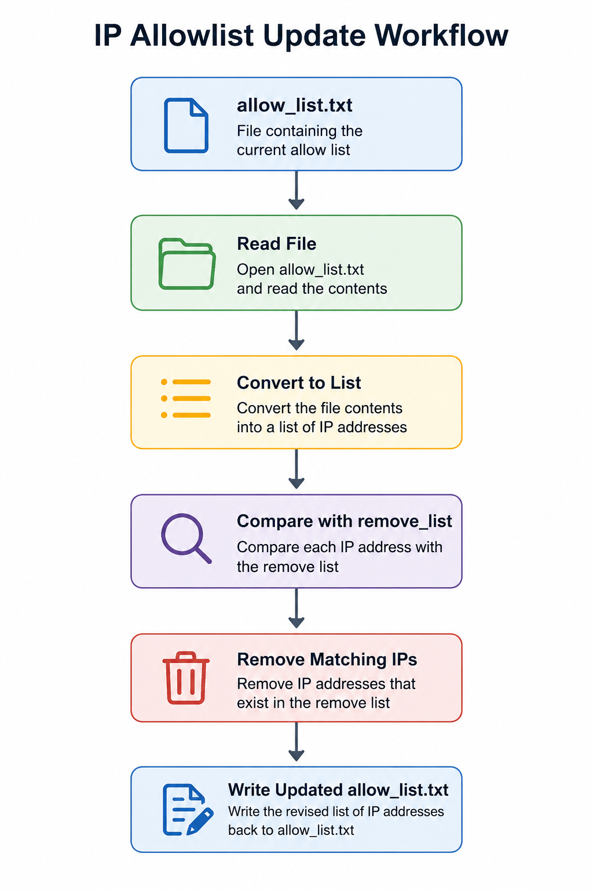

# Python IP Allowlist Automation

## Overview

This project demonstrates the use of Python to automate updates to an IP address allow list for a healthcare organization. The algorithm reads an allow list, removes IP addresses contained in a separate remove list, and writes the updated list back to the file.

The exercise highlights Python file handling, string manipulation, list processing, iteration, conditional logic, and automation of administrative security tasks.

## Scenario

A healthcare company maintains a file containing IP addresses authorized to access sensitive patient records. Employees whose addresses appear in a remove list must no longer be granted access.

The Python algorithm automates this process by identifying and removing unauthorized IP addresses before updating the allow list.

## Skills Demonstrated

- Python programming
- File input/output
- String processing
- List operations
- Loops and iteration
- Access control automation
- Security administration

## Visual Reference

## Repository Contents

- `project-description.md`
- `algorithm-walkthrough.md`
- `python-code.md`
- `summary.md`

Supporting documents are stored in the `docs/` directory.

## Outcome

The completed algorithm successfully updates the IP allow list by removing unauthorized entries and rewriting the revised list, helping enforce access control policies consistently and efficiently.
